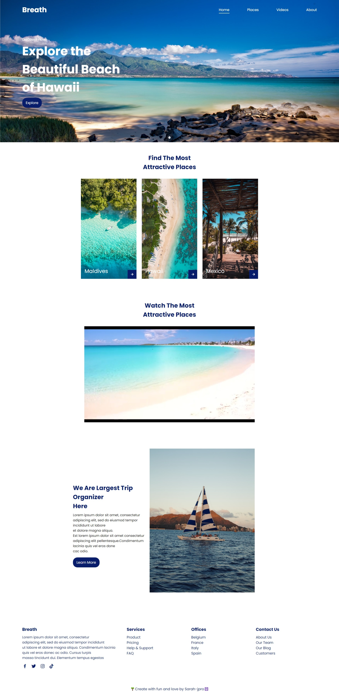
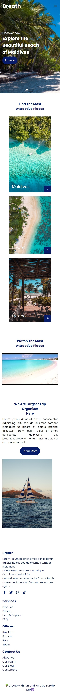

  
  
  

# :airplane: BREATH :dash:
--------------------------

 Hello, here is a little frontend project I did on my own during my training at BeCode.org :computer:
 
:sun_with_face: It's a travel website totally responsive :iphone:
____________________________________________________________________________________________________

   Languages:
   ----------
  - HTML 5
  - CSS 3
  - JavaScript

# :eyes: Let me show you : https://sarah-jpro.github.io/Travel-Breath/ 

   

 

 

 
